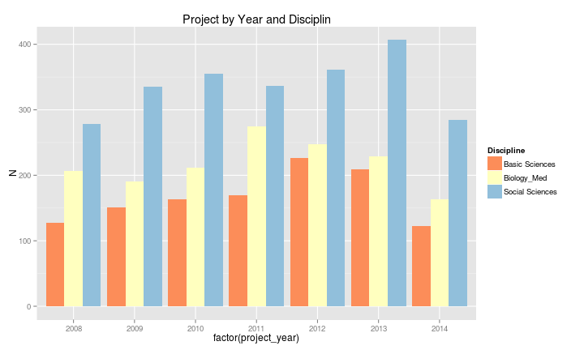
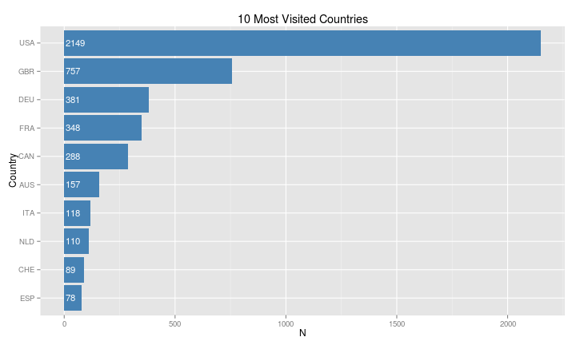
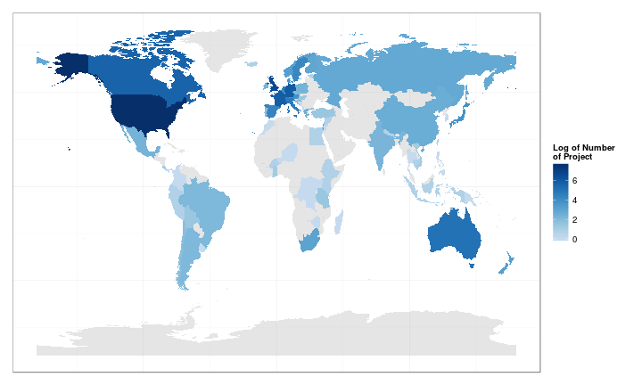
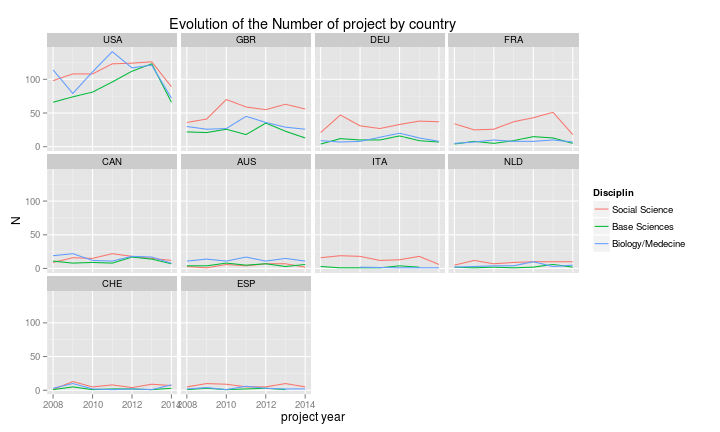
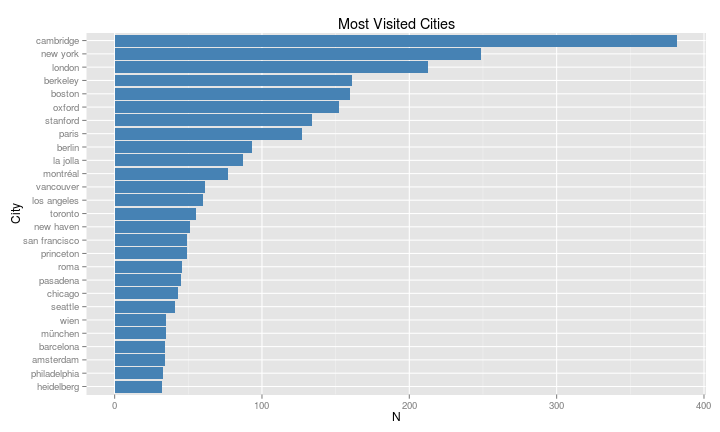

Exploratory Data Analysis
========================================================

# Loading the Data

This loads some packages necessary to perform the fist exploratory data analysis.


```r
library('ggplot2')
library('gridExtra')
library('plyr')
library('RColorBrewer')
library('data.table')
library('rCharts') # Interactive Plot
library('knitr')
library(rgdal)
library(ggplot2)
library(maptools)

gpclibPermit() # Necessary to run maptools 

opts_chunk$set(comment = NA, results = 'asis', tidy = F, message = F,
  fig.width = 10, fig.height = 6)

load('data/dat_clean.RData') # load dat
load('data/dat_agg_clean.RData') # load list dat.agg
```

# How many research project by base discipline

The first question is to know if how are distributed the project among the discplines and the years before considering the spatial dimensions.


```r
dat.base <- dat[, .N, by = 'project_year,base_disc_name']

ggplot(dat.base, aes(factor(project_year), N)) +
  geom_bar(aes(fill = base_disc_name), stat='identity', position = 'dodge') +
  scale_fill_brewer(palette = 'RdYlBu') +
  labs('title' = 'Project by Year and Disciplin', fill = 'Discipline') 
```

 

It seems there are more project funded by the SNF accross time. The proportion of reserach in the medical sciences seems to grow faster than in the other disciplines (especially in basic sciences).


```r
dat.lb <- dat.agg[[2]]
dat.l <- dat.lb[, list(N = sum(N)), by='iso3'][order(N)]

ggplot(subset(dat.l, N > 77), aes(reorder(iso3, N), N)) +
  geom_bar(stat='identity', fill ='steelblue') + coord_flip() +
  geom_text(aes(y = 5, label = N), size = 4,  hjust = 0, color = 'white') +
  labs(title = '10 Most Visited Countries', x = 'Country')
```

 

The US and the UK are dominating the location where the Swiss post-doc are pursuing their researches, which is confirmed by the following map. 


```r
world.map <- readOGR(dsn="data", layer="TM_WORLD_BORDERS_SIMPL-0.3")
```

OGR data source with driver: ESRI Shapefile 
Source: "data", layer: "TM_WORLD_BORDERS_SIMPL-0.3"
with 246 features and 11 fields
Feature type: wkbPolygon with 2 dimensions

```r
world.ggmap <- fortify(world.map, region = "ISO3")

n <- length(unique(world.ggmap$id))
df <- data.frame(iso3 = unique(world.ggmap$id), growth = 0)

ggplot(df, aes(map_id = iso3)) +
  geom_map(map = world.ggmap, alpha = 0.4, fill = 'grey') +
  geom_map(data = dat.l, aes(fill = log(N)), map = world.ggmap) +
  expand_limits(x = world.ggmap$long, y = world.ggmap$lat) +
  scale_fill_gradientn(
      colours = brewer.pal(9, 'Blues')[c(-1,-2)], guide = "colorbar",
      name = 'Log of Number\nof Project') +
  labs(y = NULL, x = NULL) + theme_bw() +
    theme(axis.line = element_blank(), axis.ticks = element_blank(),
          axis.text = element_blank())
```

 

Surprisingly, Germany, Austria, France, Canada and Italy are following this couple of country. It might not be so suprising as these countries share the same language as Switzerland.

Finally, one can note that the number of project are relatively constant and the ranking has not change that much these last years.


```r
most_country <- subset(dat.l, N > 77)$iso3
dat.lyb <- dat.agg[[1]]
dat.sub <- subset(dat.lyb, iso3 %in% most_country)
dat.sub[, iso3 := factor(iso3, levels = rev(most_country))];

ggplot(dat.sub) + facet_wrap(~iso3) +
  geom_line(aes(project_year, N, color=factor(base_disciplin))) +
  scale_color_discrete(name = 'Disciplin',
    label = c('Social Science', 'Base Sciences', 'Biology/Medecine')) +
  labs(x='project year', title='Evolution of the Number of project by country')
```

 

## Cities

As previously noted, American and Britisch cities are rulling this ranking. Notice, however, that Canadian cities are perticualary appreciated by the Swiss post-docs.

```r
dat.cb <- dat.agg[[4]]
dat.c <- dat.cb[, list(N = sum(N)), by='host_city'][order(N)]

ggplot(subset(dat.c, N > 30), aes(reorder(host_city, N), N)) +
  geom_bar(stat='identity', fill ='steelblue') + coord_flip() +
  labs(x = 'City', title = 'Most Visited Cities') 
```

 

## Conclusion

Without a lot of surprises the English speaking universities are dominating the location where the Swiss post-doc desire to pursues their career. However, we can suspect that language might also play a role as Germany, Austria and France/Canada are also among the favorite places where the Swiss post-docs expatriate.

There are however several remaining questions and other visualizations they might be interesting:

* What if we refine the analysis to the cities and not the country?
* What about the finer information about the disciplins?
* Are there relationship with the time or trends? Especially concerning developping/emerging countries?
* What about statistical analysis?
