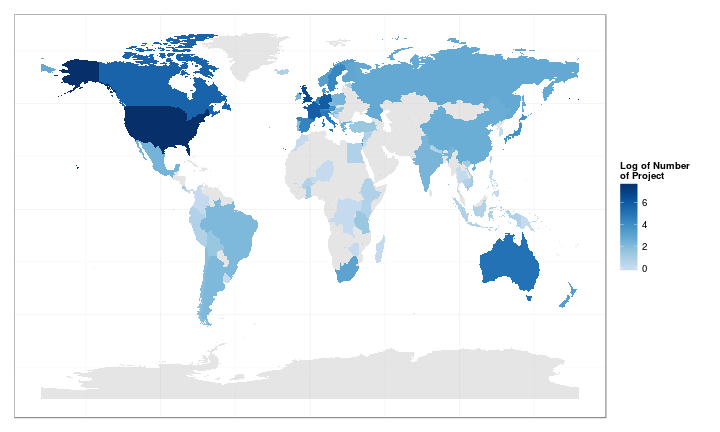

## Introduction {.smaller}

```{r, results='hide', message=FALSE, echo=FALSE}
library('ggplot2')
library('gridExtra')
library('plyr')
library('RColorBrewer')
library('data.table')
library('rCharts') # Interactive Plot
library('knitr')
library(rgdal)
library(ggplot2)
library(maptools)


opts_chunk$set(comment = NA, message = F,
  fig.width = 7, fig.height = 4)

load('../data/dat_agg_clean.RData', .GlobalEnv) # load list dat.agg
load('../data/dat_clean.RData', .GlobalEnv) # load dat
```
- The Swiss national scientific fund (SNSF or SNF) is responsible for allocating money to research in Switzerland.
- They were interested in the principal destination of junior researcher (post-docs) from Switzerland for their first assignment
- The data processing is explained on [rpubs](http://rpubs.com/davidpham87/19545).
- One can observe the distribution over the years and the disciplins of the Swiss post-doc.

```{r, echo=FALSE, fig.align='center', fig.height=3.5}
dat.base <- dat[, .N, by = 'project_year,base_disc_name']

ggplot(dat.base, aes(factor(project_year), N)) +
  geom_bar(aes_string(fill = 'base_disc_name'), stat='identity', position = 'dodge') +
  scale_fill_brewer(palette = 'RdYlBu') +
  labs('title' = 'Project by Year and Disciplin', fill = 'Discipline') 
```

## Data

- *iso3*: The three letter country intiial (eg: CHE for Switzerland).
- *project_year*: Year of the project.
- *N*: Number of projects.
- *base_disciplin*: Disciplin of the funded project with three code factors: Social Sciences (1), Base Sciences/Engineering (2), Biology Medical Sciences (3)

```{r}

head(dat.agg[[1]])
```

## Shiny Apps
The apps is an interactive in _time_ and _disciplin_ of the following maps:

<div align='center'>
  
</div>

There will be a slider for the time and checkboxes for the disciplins. Note that at each step, *R* needs to subset the correct data to redraw the map.

## Conclusion

I hope you enjoy the data exploration. However, if you desire a full version of interactivity, I invite you to visit this link:

[Github page](http://davidpham87.github.io/snf_research/)

where I recreated the plots in d3.js/javascript for a better interactive experience.

Obvisouly, I did not use the full ability of *R* for doing statistical computation when I used *shiny*. It would be intersting to use them in a future project.

